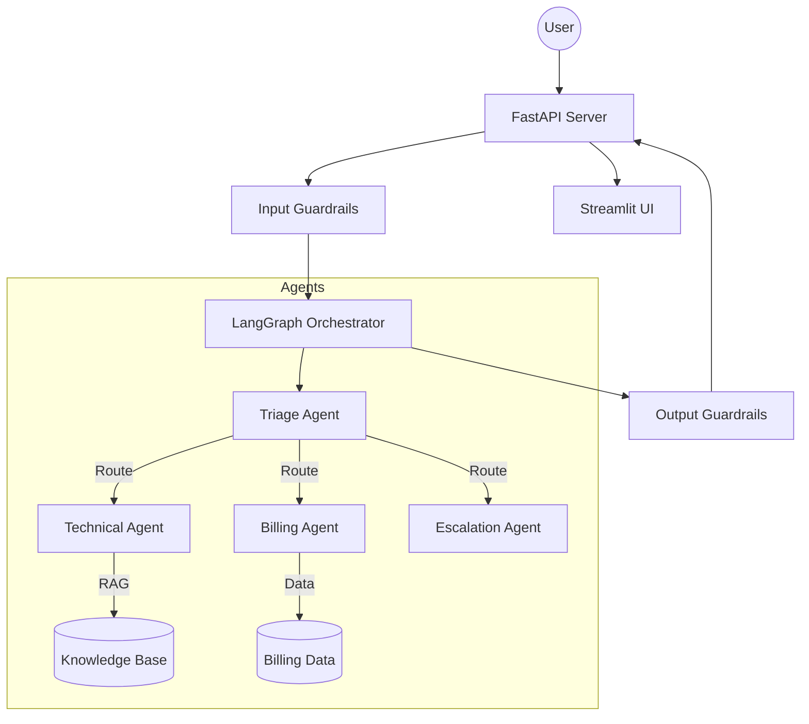

# CloudDash Multi-Agent Support — Architecture Design

This document details the system design, core modules, and state transitions of the multi-agent customer support prototype.

## System Design Overview

The system uses a structured state machine model implemented using LangGraph. Instead of allowing agents to route autonomously (which introduces unpredictability and latency), a central controller coordinates transitions between specialized nodes.

## Component Breakdown

### 1. Orchestrator & State Flow (LangGraph)
* **Triage Agent**: Inspects the user's input, extracts sentiment and urgency levels, and identifies pending intents (Technical, Billing, General, or Escalation).
* **Technical Agent**: Executes when a technical support intent is active. Performs query rewriting using conversation context, retrieves matches from the RAG pipeline, and provides step-by-step resolution steps.
* **Billing Agent**: Compares subscription tiers, explains standard billing rules, and checks plan structures.
* **Escalation Agent**: Runs when a user requests human support or when unresolved queries arise. Summarizes the state history and structures it for handoff to a human operator.

### 2. Retrieval-Augmented Generation (RAG)
* **Embedding Model**: Text chunks are embedded and queried locally.
* **ChromaDB**: An in-memory vector database holds dense semantic representations of the KB articles.
* **BM25 Search**: A keyword matching index provides keyword-level lookup for exact terms (such as `CLI`, `SAML`, `SSO`).
* **Reciprocal Rank Fusion (RRF)**: Merges dense vector rankings and sparse keyword rankings to surface the most relevant troubleshooting documents.

### 3. API & Middleware
* **FastAPI Server**: Exposes endpoints for managing conversation state, processing turns, and checking system health.
* **Input Guardrails**: Evaluates the user's input to check for prompt injections and redacts potential PII.
* **Output Guardrails**: Verifies agent responses against the retrieved context to flag unsupported negative claims, replacing them with a safe fallback response.
