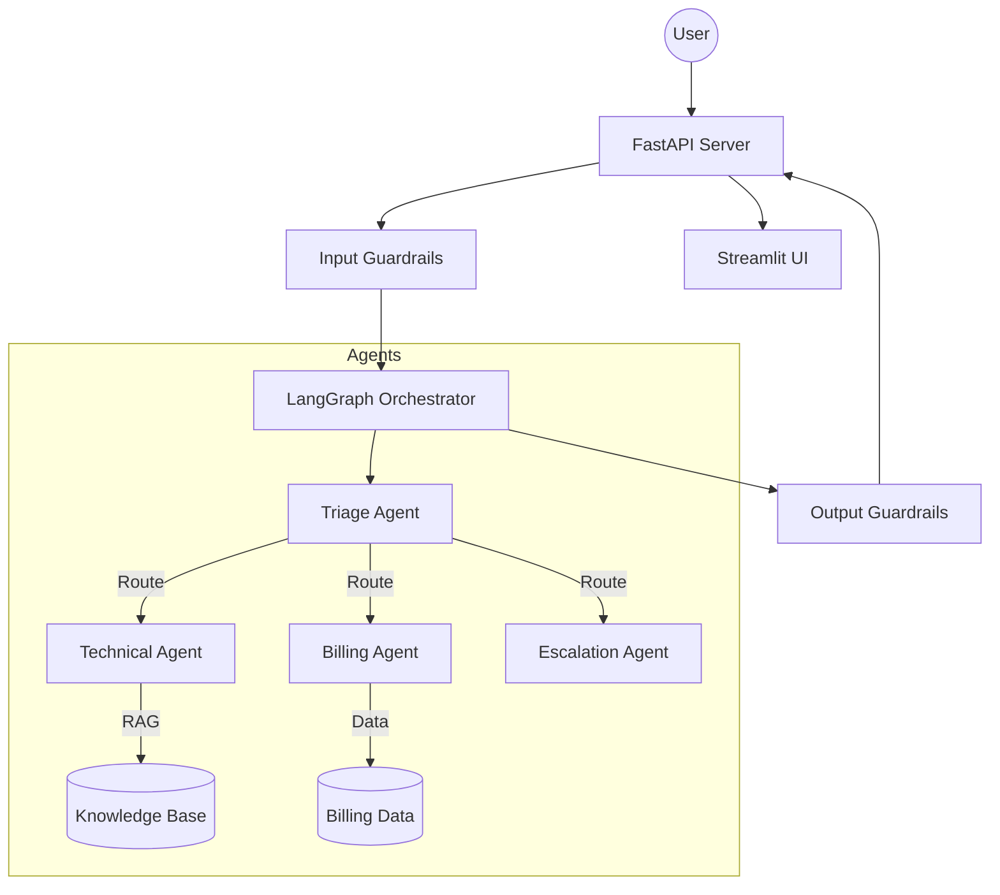

# Multi-Agent RAG Support — System Architecture

## Overview
The CloudDash Support System uses a **Multi-Agent Orchestration** pattern powered by **LangGraph**. The system is designed to route customer queries to specialized agents based on intent, grounding all technical responses in a local knowledge base.

## Core Components

### 1. Orchestration (LangGraph)
The central state machine that manages transitions between:
- **Triage Agent**: Classifies intent and routes control.
- **Technical Agent**: Performs RAG over the knowledge base.
- **Billing Agent**: Accesses customer account/plan data.
- **Escalation Agent**: Packages context for human handoff.

### 2. RAG Pipeline
- **Vector Store**: ChromaDB (dense search).
- **Keyword Search**: BM25 (sparse search).
- **Fusion**: Reciprocal Rank Fusion (RRF).
- **Query Rewriting**: Conversation-aware rewriting via Groq.

### 3. API Layer
- **FastAPI**: Provides asynchronous REST endpoints.
- **Guardrails**: PII scrubbing and prompt injection detection.
- **Session Management**: In-memory TTL-based conversation store.

## System Flow (Mermaid)

